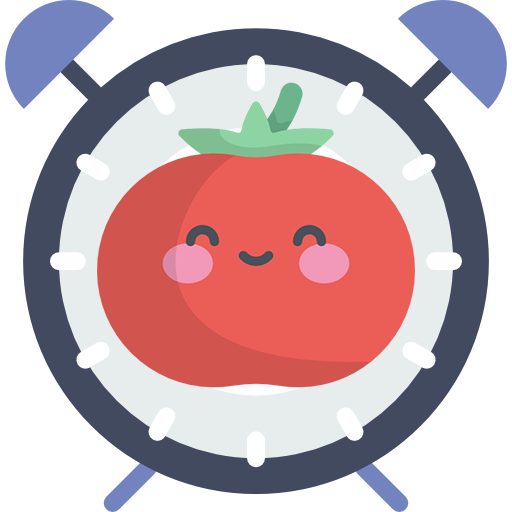
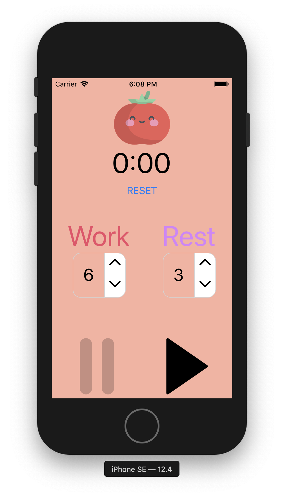

# PomodoroTimer

As my 1st project in [React Native](https://facebook.github.io/react-native/) for [CS50 Mobile](https://courses.edx.org/courses/course-v1:HarvardX+CS50M+Mobile/course/) I had to implement a Pomodoro Technique Timer. Basically, you set a *Work* and *Rest* timer to some number of minutes and then the app switches between them while you work on a task. There are [multiple ways](https://en.wikipedia.org/wiki/Pomodoro_Technique) how you can mix the timers and use not just two, but I have decided to implement the basic one. 

<p align="center">
    
</p>

## Table of contents

-   [Idea](#idea)
-   [App.js](#app.js)
-   [TimePicker.js](#timePicker.js)
-   [Credits](#credits)

## Idea

Before implementing the in React Native I took a pen and a piece of paper and made a little draft of the app. 

So my app needs the following components: 

-   Logo :tomato:
-   Timer Display (Should change color, based on the timer type (*Work*/*Rest*))
-   Some control for each timer to set it up
-   Play/Pause button 
-   Reset button

So I have decided to implement the Logo, Timer Dsiplay, Play/Pause/Reset buttons in [App.js](./App.js) and the set up control in a separate [TimePicker](./TimerPicker.js) component, beacuse it is identical for both timers

<a href='https://expo.io'>
    
</a>

## App.js

I am using [Expo](https://github.com/expo/expo) as my developing tools for React Native as well as some of their pretty libraries. 

So, in my main [App.js](./App.js) I first import some predefined and common components and also my own [TimePicker](./TimerPicker.js).

```javascript
import React from 'react'
import {View, Text, Button, StyleSheet, Image, TouchableOpacity, Vibration} from 'react-native'
import Constants from 'expo-constants'
import TimePicker from './TimePicker.js'
```

Then I make some styles using `StyleSheet.create()` function. I have not used all the definedd styles, so let me crarify things here.

- `appContainer` - defines just the overall look of my App
- `timerSetContainer` - is used for two [TimePicker](./TimerPicker.js) components and Play/Pause buttons
- `imgActive` and `imgInactive` - used for Images of Play/Pause buttons
- `touchButton` - used for Play/Pause button component itself

```javascript
const styles = StyleSheet.create({
  appContainer: {
    flex: 1, 
    backgroundColor: '#fab1a0',
  },
  timerContainer: {
    marginTop: "4%",
  },
  timerSetContainer: {
      flexDirection: 'row',
      justifyContent: 'space-around',
      marginTop: "10%",
  },
  imgActive: {
    width: 100,
    height: 100,
    alignSelf: 'center',
    marginTop: Constants.statusBarHeight,
  },
  imgInactive: {
    width: 100,
    height: 100,
    alignSelf: 'center',
    opacity: 0.2,
    marginTop: Constants.statusBarHeight,
  },
  touchButton: {
    alignSelf: 'center',
    marginTop: "10%",
    marginRight: 150, 
    marginLeft: 150, 
  },
  timerPosition: {
    alignItems: 'center',
  },
  text: {
    fontSize: 50,
  }
})
```

I also predefined as global constants the colors for Work/Rest timers' text.

- Work: 
- Rest: 

```javascript
const colorWork = '#ED4C67' 
const colorRest = '#D980FA'
```

## TimePicker.js


## Credits 

<div>Icon of a cute Tomato and Pause Button was made by <a href="https://www.flaticon.com/authors/freepik" title="Freepik">Freepik</a> from <a href="https://www.flaticon.com/"             title="Flaticon">www.flaticon.com</a></div>

<div>Icon of an Alarm Clock, Play Button was made by <a href="https://www.flaticon.com/authors/smashicons" title="Smashicons">Smashicons</a> from <a href="https://www.flaticon.com/"             title="Flaticon">www.flaticon.com</a></div>